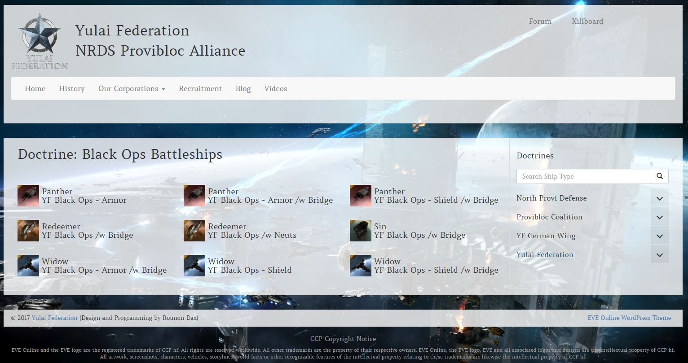

# EVE Online Fitting Manager for WordPress

## Build your own fitting and doctrine overview in WordPress

### Screenshot

### Hint
This plugin works best with WordPress themes utilizing the Bootstrap Framework. If your Theme doesn't use it, you might end up having to tweak it here and there a bit.
Works best with the [EVE Online WordPress Theme](https://github.com/ppfeufer/eve-online-wordpress-theme)

### Installation
To install the plugin simply [download the archive](https://github.com/ppfeufer/eve-online-fitting-manager/archive/master.zip) or one of the [releases](https://github.com/ppfeufer/eve-online-fitting-manager/releases), unzip it, rename the folder to `eve-online-fitting-manager` (this is important, or automatic updates might cause trouble) and copy the folder into your plugin directory in your WordPress installation.

### Set Up
Now go to your Pages menu in your WordPress Backend and add a new page called "Fittings" or what ever you like it to be called.
Make sure you set the page template to "Fittings", otherwise the plugin will not recognize this page as it's own.
Than go to Settings -> Permalinks and hit the "Save Changes" button in order to make sure everything works just fine.
Start managing your fittings under the "Fittings" Menu in your Dashboard.

### Changelog
see [CHANGELOG.md](CHANGELOG.md)
